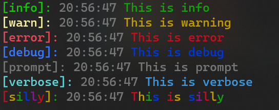

# ps-logger



 
- [](https://npmjs.com/package/ps-logger)

- <a href="https://dev.to/imshivanshpatel" target="blank"></a>
<a href="https://linkedin.com/in/shivansh-patel-4915b4171" target="blank"></a>
<a href="https://instagram.com/programming_updates" target="blank"></a>
- ps-logger is a production grade logger, basically it is used for logging info,warning,error,silly,verbose,prompt and debug statements


## **`File logger`** added in this release (1.0.7)

#### usage examples:-

```JAVASCRIPT
const logger=require('ps-logger');

logger.info("This is info")
logger.warn("This is warning");
logger.error("This is error");
logger.debug("This is debug");
logger.prompt("This is prompt");
logger.verbose("This is verbose");
logger.silly("This is silly");
```


#### disabling or enabling color
- By default it is set to true,so you dont need to set it as true

```javascript
logger.setColor(false);
```


#### In TypeScript

```javascript
import {info} from "ps-logger";

info(`server is running on port ${port} `)
```

#### File Logging
```javascript
const { logToFile,info } = require("ps-logger");

// set it to `true` to log into the file

// second param is file name and it's optional if you don't pass file name then it will log into ps-logger.log file

logToFile(true,'todaysLog');


info("This will output into log file")
```