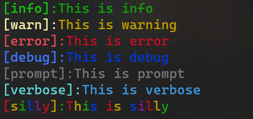

# ps-logger



- ps-logger is a production grade logger, basically it is used for logging info,warning,error,silly,verbose,prompt and debug statements

#### usage examples:-

```JAVASCRIPT
const logger=require('ps-logger');

logger.info("This is info")
logger.warn("This is warning");
logger.error("This is error");
logger.debug("This is debug");
logger.prompt("This is prompt");
logger.verbose("This is verbose");
logger.silly("This is silly");
```


#### disabling or enabling color
- By default it is set to true,so you dont need to set it as true

```javascript
logger.setColor(false);
```